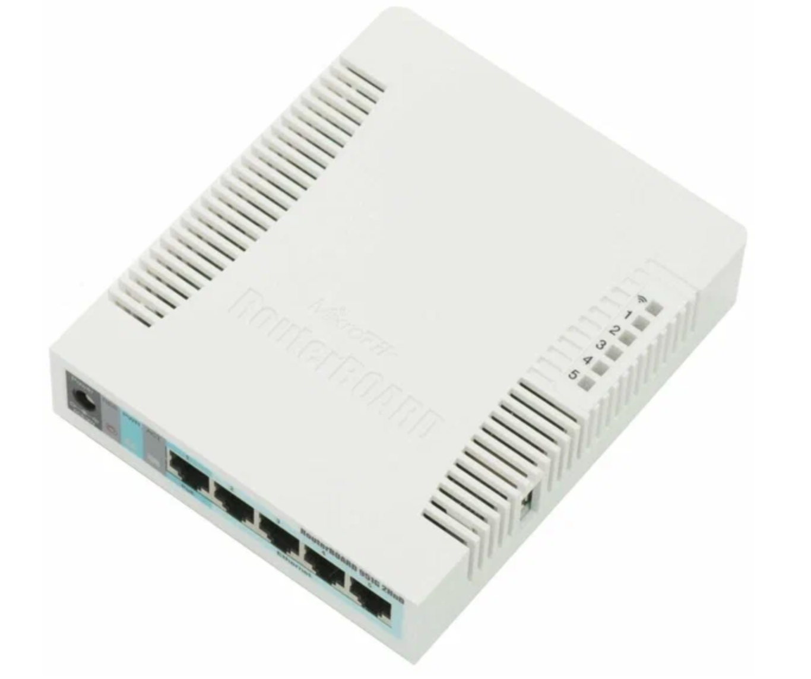
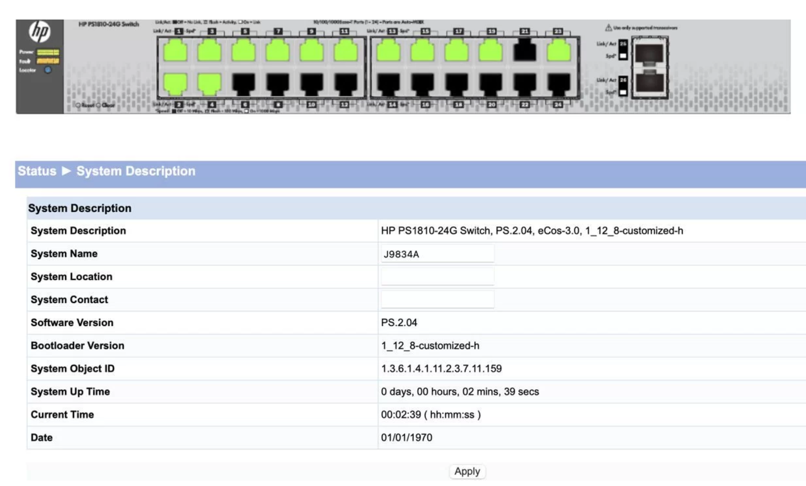
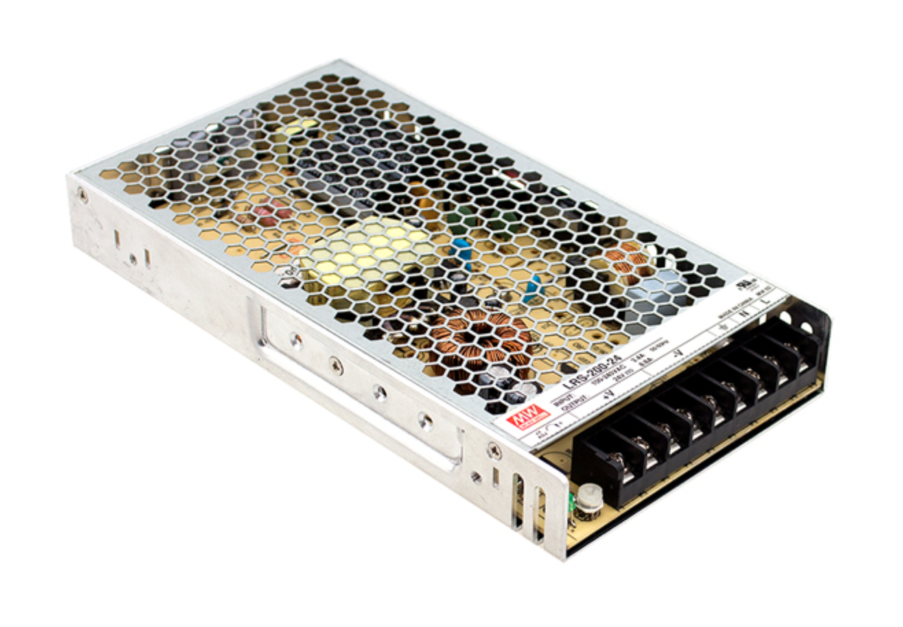
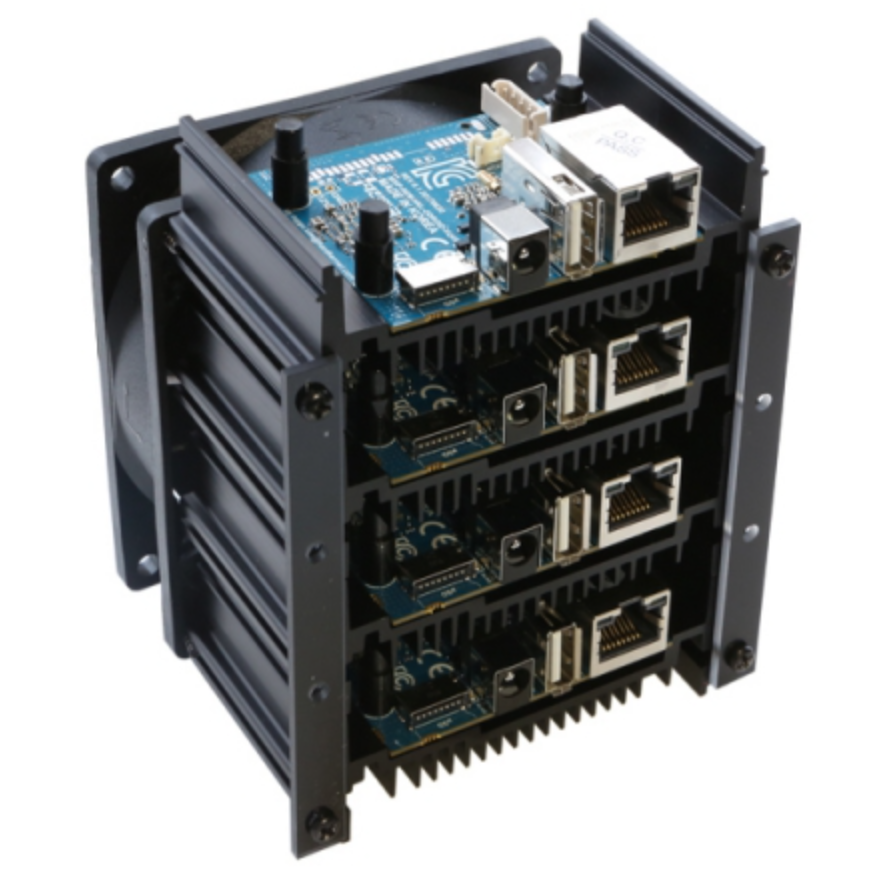
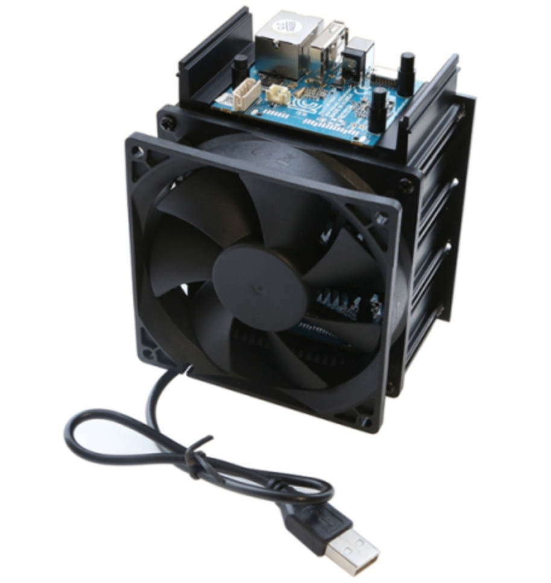
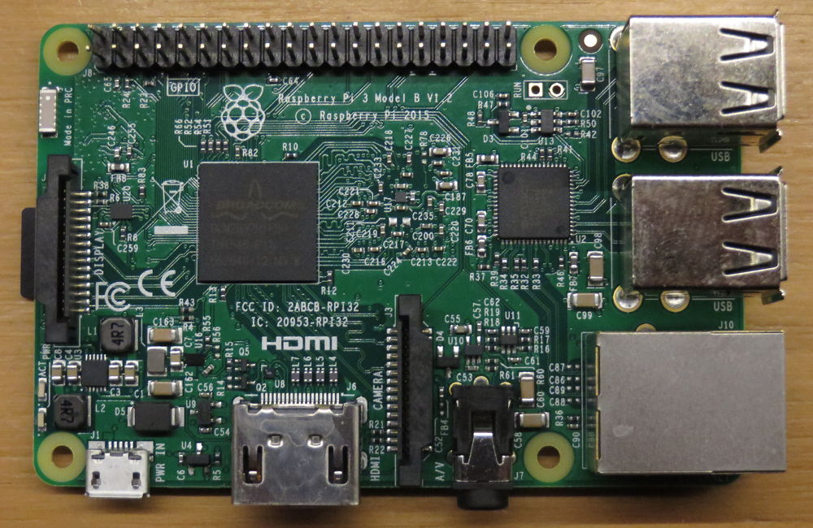
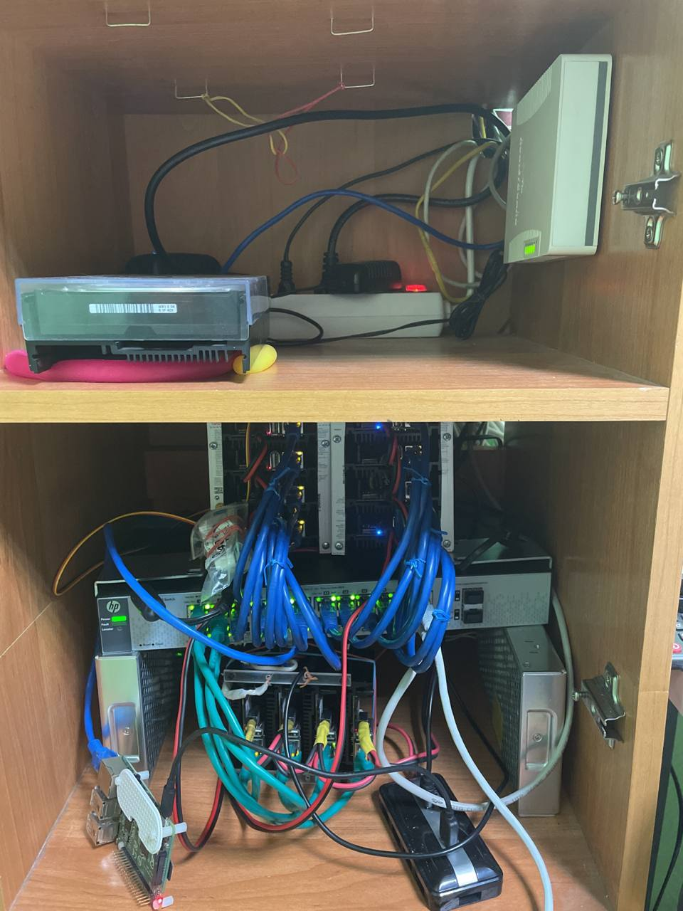

odr-oid_cl_er
Odroid cluster mc1 (12)

Проект на 12 одноплатных Odroid-Mc1:
- Samsung Exynos5422 (8 ядер)
- 2Гб LPDDR3
- 1000 Мбит ...

```
Под управлением Raspberry Pi4 (4Gb)
```
Общее количество ядер: 96 CPU
Общее количество RAM:  24 Gb


# Part 1. Инструменты

__Определи и запиши в отчёт:__

### 1) MikroTik RB951G-2HnD
 
### 2) Odroid HC2 (Home cloud)
 
### 3) Коммутатор HP PS1810-24G(J9834A)

### 4) LRS-200-5 / MEAN WELL (х2)

### 5) Odroid MC1 (3х4)


### 6) Raspberry Pi 3b 1.2


_____________________
___________________
Не завершен


  
